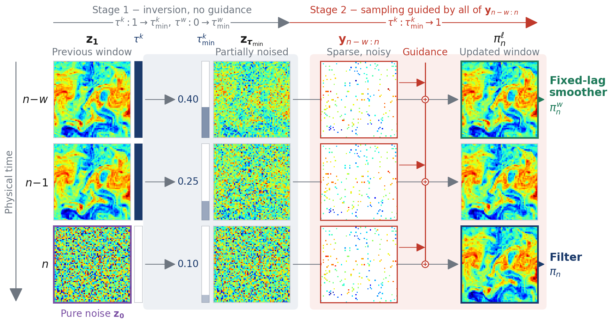

# DAWIS

[](https://arxiv.org/abs/2610.03314)



Official code for **DAWIS: Data Assimilation with Windowed Inverse Sampling via Multitask Interpolants** ([paper](https://arxiv.org/abs/2610.03314)).

by [Erik Wikingsson](https://github.com/Erik-Wikingsson)\*, [Martin Andrae](https://martinandrae.github.io/)\*, Tomas Landelius and [Fredrik Lindsten](https://lindsten.netlify.app/)
(\* equal contribution)

## Overview

Flow- and diffusion-based generative models have recently emerged as flexible and highly efficient forecasting models for dynamical systems. When combined with inference-time guidance, they offer a promising route to high-dimensional non-Gaussian data assimilation (DA), the problem of combining forecasts with observations to estimate latent system states. Existing filters, however, condition on a fixed history and assimilate only the most recent observation, leaving them unable to revise past states when new observations arrive. Estimates then stay tethered to a history that later observations may contradict, and errors accumulate over the assimilation run. To this end, we introduce DAWIS, a unified DA method covering filtering, fixed-lag smoothing, and block smoothing within a single framework. DAWIS replaces the single flow time of a state-level prior with a multitask stochastic interpolant over a window of consecutive states, assigning a separate flow time to each. An assimilation cycle inverts the window to a vector of per-state turning points and regenerates it under observation guidance, with the turning points controlling how strongly each state is held fixed, revised, or generated from scratch. The same construction can also absorb the forecast into the assimilation cycle, removing the need for a separate forecasting model. Experiments on challenging nonlinear systems show that DAWIS improves on both filtering and smoothing baselines under sparse, noisy, and nonlinear observations.

## Setup

```bash
git clone https://github.com/Erik-Wikingsson/DAWIS.git dawis && cd dawis
mamba env create -f environment.yaml      # or: conda env create -f environment.yaml
mamba activate dawis
cp .env.example .env                      # then edit the paths in .env
export PYTHONPATH=$(pwd)                  # every command below runs from the repo root
```

All machine-specific paths are read from `.env` (variables already set in the environment take precedence). The ones you need:

| Variable | What it points to |
| --- | --- |
| `SQG_ROOT` | SQG trajectories (generated below) |
| `SEVIR_ROOT` | SEVIR-LR data, containing `sevir_lr/` |
| `MODELS_ROOT` | pretrained checkpoints |
| `RESULTS_ROOT` | where assimilation runs write their `.nc` results |
| `WANDB_ENTITY` | optional; your Weights & Biases entity |

See [`.env.example`](.env.example) for the rest (per-checkpoint overrides, SLURM job mail, conda environment name).

## Data

### SQG

The surface quasi-geostrophic (SQG) data is simulated with the numerical model in `data/SQG/sqgturb`:

```bash
bash data/SQG/generate_splits.sh --jobs 32
```

This writes the layout `data/SQG/config.yaml` expects under `$SQG_ROOT` (64×64 grid, 3-hour cadence) and then computes the normalization statistics:

| Split | Directory | Trajectories | States each |
| --- | --- | --- | --- |
| train | `train/64_3h` | 2000 | 101 |
| val | `val/64_3h` | 1 | 101 |
| test | `test/64_3h` | 11 | 111 |
| test_long | `test/64_3h_1000step` | 1 | 1001 |

One trajectory takes about 1.5 minutes on one core (most of it is the 300-day spin-up), so the train split is about 50 CPU hours; `--jobs` runs that many processes in parallel. `--n_train`, `--splits` and `--seed` change what is generated, and `--variant hires` generates the 256×256 variant. On a SLURM cluster, `scripts/submit.sh data/SQG/gen_data.sh` runs the same script as a 32-core job.

Test trajectory 0 is used for tuning; trajectories 1–10 are the evaluation set.

### SEVIR

We use SEVIR-LR, the low-resolution version of the SEVIR vertically integrated liquid (VIL) radar data. [Download it here](https://www.dropbox.com/scl/fi/h83pp33jx5gz62gk0gncs/sevir_lr.zip?rlkey=dtnnk6x4af0hhrneugijhq60s&st=ux0ud8pz&dl=0) (3.8 GB) and unzip it into `$SEVIR_ROOT`:

```bash
cd "$SEVIR_ROOT"
wget -O sevir_lr.zip "https://www.dropbox.com/scl/fi/h83pp33jx5gz62gk0gncs/sevir_lr.zip?rlkey=dtnnk6x4af0hhrneugijhq60s&st=ux0ud8pz&dl=1"
unzip sevir_lr.zip && rm sevir_lr.zip
```

This gives:

```
$SEVIR_ROOT/sevir_lr/CATALOG.csv
$SEVIR_ROOT/sevir_lr/data/vil/{2017,2018,2019}/*.h5
```

The train/validation/test split is defined in [`data/SEVIR/config.yaml`](data/SEVIR/config.yaml). See [`data/README.md`](data/README.md) for the data interface and how to add a dataset.

## Pretrained models

The pretrained checkpoints are on Hugging Face at [Erik-Wikingsson/dawis-checkpoints](https://huggingface.co/Erik-Wikingsson/dawis-checkpoints): the DAWIS window models for SQG and SEVIR at window length 6 (`--init_states 6`), the DAISI priors for both datasets, and the SQG FlowDAS forecaster. The repository has the folder layout the code expects, so download it and point `MODELS_ROOT` at it:

```bash
hf download Erik-Wikingsson/dawis-checkpoints --local-dir /path/to/models   # pip install huggingface_hub
```

The SQG FlowDAS forecaster (`SQG/models/flowdas/flowdas_sqg_3hrly.pt`, the backbone from [DAISI](https://arxiv.org/abs/2512.00252)) is included in the download. For SEVIR, all methods that need an external forecast use the pretrained checkpoint released by [FlowDAS](https://github.com/umjiayx/FlowDAS), which is not redistributed here. Download it into the same folder:

```bash
curl -L -o /path/to/models/SQG/models/flowdas/flowdas_sevir.pt \
    "https://www.dropbox.com/scl/fi/5z1bwfdvbztnums9deqhe/latest.pt?rlkey=o5izt721am3hzkcwjmmn7joym&dl=1"
```

or set `FLOWDAS_SEVIR_MODEL_PATH` to wherever you saved it. Other window lengths are not released; train them as described below.

The expected file names are listed in [`assimilation/checkpoints.py`](assimilation/checkpoints.py) (`PRIORS` and `FMW_MODELS`) and [`forecasting/flowdas_forecaster.py`](forecasting/flowdas_forecaster.py) (the FlowDAS forecasters). DAWIS uses one window model per window length, selected by `--init_states` (the window holds `init_states + 1` states), so no `--model_path` is needed. Any single checkpoint can be overridden in `.env`, or with `--model_path`.

## Training

**DAWIS window prior** (the multitask interpolant, `forecasting/trainer.py --model FMW`):

```bash
bash forecasting/training_scripts/SQG/train_all_fmw.sh                          # SQG, windows 1-6
VARIANT=lr_vil NORM=flowdas bash forecasting/training_scripts/SEVIR/train_all_fmw.sh  # SEVIR, windows 2, 4, 6
```

These submit one SLURM job per window length; `train_one_fmw.sh` holds the full set of training arguments. Checkpoints are written to `saved_models/<run name>/`; pass one with `--model_path`, or add it to `FMW_MODELS`.

**DAISI prior.** The unconditional prior for the DAISI baseline is trained with `unconditional_generation/scripts/SQG/train_64.sh` (SQG) and `unconditional_generation/scripts/SEVIR/train_prior.sh` (SEVIR). The FlowDAS forecasters are not retrained here: the SQG one is the DAISI backbone (included in the download), the SEVIR one is FlowDAS's.

## Running DAWIS

A single DAWIS-Joint run on the SQG `noisy` experiment (window of 7 states, 20 ensemble members, 100 assimilation steps):

```bash
python -m assimilation.assimilate --method DAWIS --experiment noisy --data_index 1 \
    --init_states 6 --forward_model dawis \
    --tmin_start 0.4 --tmin_end 0.3 --tmin_init 0 0 0 0 0 0.9 \
    --guide_method MMPS --guidance_strength 1.0 --noise invert --eps 0.03 --invert_eps 0.03 \
    --euler_steps 100 --invert_steps 100 --init_state GT_edit --x0_sigma 1 \
    --n_ens 20 --n_times 100
```

The result is written to `$RESULTS_ROOT/<exp_name>_<date>_<id>.nc`, and the metrics are logged to W&B (set `WANDB_MODE=offline` to keep them local).

- **Experiments.** `--experiment` selects the observation setting: `noisy`, `sparse`, `multimodal` or `saturating` on SQG, and `sevir` with `--dataset SEVIR`.
- **DAWIS Filter vs. DAWIS-Joint.** `--forward_model dawis` generates the new state with the window prior itself (DAWIS-Joint); `--forward_model numerical` (SQG) or `flowdas` (SEVIR) takes the forecast from an external model (DAWIS Filter).
- **Lagged smoother.** Each run stores both the filter (last window slot, `x_assim` in the result file) and the fixed-lag smoother (first window slot, `x_smooth`); `--save_window_states` also stores every slot.
- **Block smoother.** `python -m assimilation.smoothing --method GIBBS ...` refines a finished run (e.g. a DAWIS Filter run, given with `--trajectory_path`) with the DAWIS Block Smoother or the Block Gibbs Smoother; see `run_all_Gibbs.bash` for the settings.

### Reproducing the paper

The paper's configurations are in the SLURM launchers under [`assimilation/scripts/SQG`](assimilation/scripts/SQG) and [`assimilation/scripts/SEVIR`](assimilation/scripts/SEVIR). `--sweep false` selects the tuned configuration, `DATA_INDICES` the trajectories, and `DRY_RUN=1` prints the jobs instead of submitting them:

```bash
DRY_RUN=1 DATA_INDICES="1 2 3 4 5 6 7 8 9 10" bash assimilation/scripts/SQG/run_all_DAWIS.bash --sweep false
```

| Method | SQG launcher (SEVIR: `run_all_*.sh`) |
| --- | --- |
| DAWIS Filter / Lagged Smoother, DAWIS-Joint | `run_all_DAWIS.bash` |
| DAWIS Block / Soft Block Smoother, Block Gibbs Smoother | `run_all_Gibbs.bash` |
| SDA-Filter | `run_all_SDA_filter.bash` |
| SDA | `run_all_SDA.bash` |
| Joint AR 1\|W, W\|1 | `run_all_GuidedForecast.bash` |
| ForcingDAS-Pyr | `run_all_ForcingDAS.bash` |
| DAISI | `run_all_DAISI.bash` |
| FlowDAS | `run_all_FlowDAS.bash` |
| EnSF | `run_all_EnSF.bash` |
| LETKF | `run_all_LETKF.bash` |

See [`assimilation/scripts/README.md`](assimilation/scripts/README.md) for the launcher options. The `#SBATCH` headers contain settings for the Berzelius cluster (`-C fat`/`thin` node types, the `berzelius-cpu` partition, the `Mambaforge` module in `scripts/conda_env.sh`); adjust them for your cluster, and set `MAMBA_MODULE=""` in `.env` if you have no environment modules.

## Tests

```bash
python -m pytest tests -q
```

Tests that need data or checkpoints skip when `SQG_ROOT`, `SEVIR_ROOT` or `MODELS_ROOT` is not available.

## Repository structure

```
assimilation/             data assimilation
  assimilate.py           filters: DAWIS, DAISI, LETKF, EnSF, FlowDAS
  smoothing.py            smoothers: SDA, block Gibbs / DAWIS block smoother
  methods/                the methods
  observers/              observation operators
  experiments.py          the experiment presets (noisy, sparse, ...)
  checkpoints.py          which pretrained checkpoint each method loads
  scripts/{SQG,SEVIR}/    SLURM launchers
data/                     data sources (SQG, SEVIR), paths and normalization statistics
forecasting/              the window prior (models/fmw.py), FlowDAS and SQG forecasters
unconditional_generation/ unconditional prior used by DAISI
networks/                 U-Net backbones (from EDM)
metrics/, linalg/, plotting/, utils.py
scripts/                  shell helpers (.env loading, conda, SLURM mail)
tests/
```

## Citation

```bibtex
@article{wikingsson2026dawis,
  title         = {{DAWIS}: Data Assimilation with Windowed Inverse Sampling via Multitask Interpolants},
  author        = {Wikingsson, Erik and Andrae, Martin and Landelius, Tomas and Lindsten, Fredrik},
  journal       = {arXiv preprint arXiv:2610.03314},
  year          = {2026},
  eprint        = {2610.03314},
  archivePrefix = {arXiv},
  primaryClass  = {stat.ML},
  url           = {https://arxiv.org/abs/2610.03314}
}
```

DAWIS builds on DAISI:

```bibtex
@inproceedings{andrae2026daisi,
  title     = {{DAISI}: Data Assimilation with Inverse Sampling using Stochastic Interpolants},
  author    = {Andrae, Martin and Larsson, Erik and Takao, So and Landelius, Tomas and Lindsten, Fredrik},
  booktitle = {Proceedings of the 43rd International Conference on Machine Learning (ICML)},
  year      = {2026},
  url       = {https://arxiv.org/abs/2512.00252}
}
```

## Acknowledgements
This repository builds on [DAISI](https://github.com/Erik-Wikingsson/DAISI) (Data Assimilation with Inverse Sampling using Stochastic Interpolants, ICML 2026), which it extends from single states to windows of states.

This repository uses components from [EDM](https://github.com/NVlabs/edm) (network architectures), [sqgturb](https://github.com/jswhit/sqgturb) (the SQG model), [FlowDAS](https://github.com/umjiayx/FlowDAS), [SDA](https://github.com/francois-rozet/sda) and [EnSF](https://github.com/Siming-Liang/EnSFInpainting).

## License

[CC BY-NC-SA 4.0](LICENSE). Files adapted from other projects keep their original license notices.
